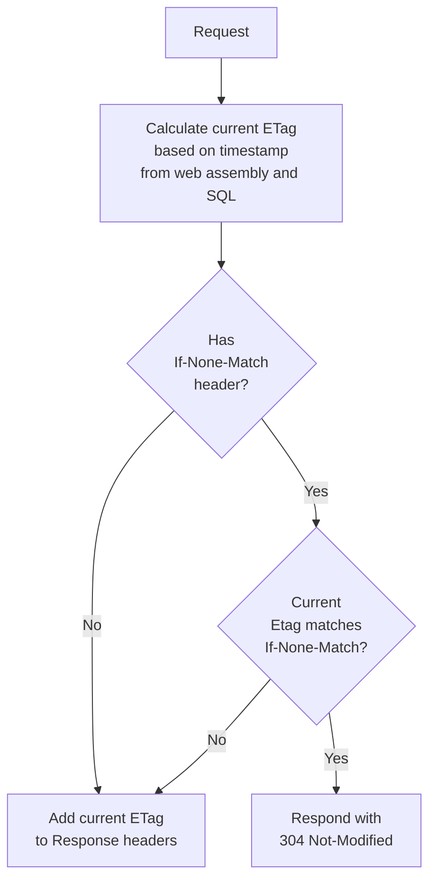

<!--
GENERATED FILE - DO NOT EDIT
This file was generated by [MarkdownSnippets](https://github.com/SimonCropp/MarkdownSnippets).
Source File: /readme.source.md
To change this file edit the source file and then run MarkdownSnippets.
-->

#  Delta

[](https://ci.appveyor.com/project/SimonCropp/Delta)
[](https://www.nuget.org/packages/Delta/)
[](https://www.nuget.org/packages/Delta.EF/)

Delta is an opinionated approach to implementing a [304 Not Modified](https://www.keycdn.com/support/304-not-modified)

The approach uses a last updated timestamp from the database to generate an [ETag](https://developer.mozilla.org/en-US/docs/Web/HTTP/Headers/ETag). All dynamic requests then have that ETag checked/applied.

This approach works well when the frequency of updates is relatively low. In this scenario, the majority of requests will leverage the result in a 304 Not Modified being returned and the browser loading the content its cache.

Effectively consumers will always receive the most current data, while the load on the server remains very low.

**See [Milestones](../../milestones?state=closed) for release notes.**


## Assumptions

Assumes the following combination of technologies are being used:

 * Frequency of updates to data is relatively low compared to reads
 * [ASP.NET Core](https://learn.microsoft.com/en-us/aspnet/core/)
 * [Microsoft SQL Server](https://www.microsoft.com/en-au/sql-server)
 * Either [SQL Server Change Tracking](https://learn.microsoft.com/en-us/sql/relational-databases/track-changes/track-data-changes-sql-server) and/or [SQL Server Row Versioning](https://learn.microsoft.com/en-us/sql/t-sql/data-types/rowversion-transact-sql)


## 304 Not Modified Flow




## ETag calculation logic

The ETag is calculated from a combination several parts


#### AssemblyWriteTime

The last write time of the web entry point assembly

<!-- snippet: AssemblyWriteTime -->
<a id='snippet-AssemblyWriteTime'></a>
```cs
var webAssemblyLocation = Assembly.GetEntryAssembly()!.Location;
AssemblyWriteTime = File.GetLastWriteTime(webAssemblyLocation).Ticks.ToString();
```
<sup><a href='/src/Delta/DeltaExtensions_Shared.cs#L230-L235' title='Snippet source file'>snippet source</a> | <a href='#snippet-AssemblyWriteTime' title='Start of snippet'>anchor</a></sup>
<!-- endSnippet -->


#### SQL timestamp

A combination of [change_tracking_current_version](https://learn.microsoft.com/en-us/sql/relational-databases/system-functions/change-tracking-current-version-transact-sql) (if tracking is enabled) and [@@DBTS (row version timestamp)](https://learn.microsoft.com/en-us/sql/t-sql/functions/dbts-transact-sql)


<!-- snippet: SqlTimestamp -->
<a id='snippet-SqlTimestamp'></a>
```cs
declare @changeTracking bigint = change_tracking_current_version();
declare @timeStamp bigint = convert(bigint, @@dbts);

if (@changeTracking is null)
  select cast(@timeStamp as varchar)
else
  select cast(@timeStamp as varchar) + '-' + cast(@changeTracking as varchar)
```
<sup><a href='/src/Delta/DeltaExtensions_Shared.cs#L214-L222' title='Snippet source file'>snippet source</a> | <a href='#snippet-SqlTimestamp' title='Start of snippet'>anchor</a></sup>
<!-- endSnippet -->


#### Suffix

An optional string suffix that is dynamically calculated at runtime based on the current `HttpContext`.

<!-- snippet: Suffix -->
<a id='snippet-Suffix'></a>
```cs
var app = builder.Build();
app.UseDelta(suffix: httpContext => "MySuffix");
```
<sup><a href='/src/DeltaTests/Usage.cs#L9-L14' title='Snippet source file'>snippet source</a> | <a href='#snippet-Suffix' title='Start of snippet'>anchor</a></sup>
<!-- endSnippet -->


### Combining the above

<!-- snippet: BuildEtag -->
<a id='snippet-BuildEtag'></a>
```cs
internal static string BuildEtag(string timeStamp, string? suffix)
{
    if (suffix == null)
    {
        return $"\"{AssemblyWriteTime}-{timeStamp}\"";
    }

    return $"\"{AssemblyWriteTime}-{timeStamp}-{suffix}\"";
}
```
<sup><a href='/src/Delta/DeltaExtensions_Shared.cs#L305-L317' title='Snippet source file'>snippet source</a> | <a href='#snippet-BuildEtag' title='Start of snippet'>anchor</a></sup>
<!-- endSnippet -->


## NuGet

Delta is shipped as two nugets:

 * [Delta](https://nuget.org/packages/Delta/): Delivers functionality using SqlConnection and SqlTransaction.
 * [Delta.EF](https://nuget.org/packages/Delta.EF/): Delivers functionality using [SQL Server EF Database Provider](https://learn.microsoft.com/en-us/ef/core/providers/sql-server/?tabs=dotnet-core-cli).

Only one of the above should be used.


## Usage


### Add to WebApplicationBuilder

<!-- snippet: UseDelta -->
<a id='snippet-UseDelta'></a>
```cs
var builder = WebApplication.CreateBuilder();
builder.Services.AddScoped(_ => new SqlConnection(connectionString));
var app = builder.Build();
app.UseDelta();
```
<sup><a href='/src/WebApplication/Program.cs#L10-L17' title='Snippet source file'>snippet source</a> | <a href='#snippet-UseDelta' title='Start of snippet'>anchor</a></sup>
<!-- endSnippet -->


### Add to a Route Group

To add to a specific [Route Group](https://learn.microsoft.com/en-us/aspnet/core/fundamentals/minimal-apis/route-handlers#route-groups):

<!-- snippet: UseDeltaMapGroup -->
<a id='snippet-UseDeltaMapGroup'></a>
```cs
app.MapGroup("/group")
    .UseDelta()
    .MapGet("/", () => "Hello Group!");
```
<sup><a href='/src/WebApplication/Program.cs#L58-L64' title='Snippet source file'>snippet source</a> | <a href='#snippet-UseDeltaMapGroup' title='Start of snippet'>anchor</a></sup>
<!-- endSnippet -->


### ShouldExecute

Optionally control what requests Delta is executed on.

<!-- snippet: ShouldExecute -->
<a id='snippet-ShouldExecute'></a>
```cs
var app = builder.Build();
app.UseDelta(
    getConnection: httpContext => httpContext.RequestServices.GetRequiredService<SqlConnection>(),
    shouldExecute: httpContext =>
    {
        var path = httpContext.Request.Path.ToString();
        return path.Contains("match");
    });
```
<sup><a href='/src/DeltaTests/Usage.cs#L19-L30' title='Snippet source file'>snippet source</a> | <a href='#snippet-ShouldExecute' title='Start of snippet'>anchor</a></sup>
<!-- endSnippet -->


### Custom Connection discovery

By default, Delta uses `HttpContext.RequestServices` to discover the SqlConnection and SqlTransaction:

<!-- snippet: DiscoverConnection -->
<a id='snippet-DiscoverConnection'></a>
```cs
static Connection DiscoverConnection(HttpContext httpContext)
{
    var provider = httpContext.RequestServices;
    var connection = provider.GetRequiredService<SqlConnection>();
    var transaction = provider.GetService<SqlTransaction>();
    return new(connection, transaction);
}
```
<sup><a href='/src/Delta/DeltaExtensions_MiddleWare.cs#L65-L75' title='Snippet source file'>snippet source</a> | <a href='#snippet-DiscoverConnection' title='Start of snippet'>anchor</a></sup>
<!-- endSnippet -->

To use custom connection discovery:

<!-- snippet: CustomDiscoveryConnection -->
<a id='snippet-CustomDiscoveryConnection'></a>
```cs
var application = webApplicationBuilder.Build();
application.UseDelta(
    getConnection: httpContext => httpContext.RequestServices.GetRequiredService<SqlConnection>());
```
<sup><a href='/src/DeltaTests/Usage.cs#L194-L200' title='Snippet source file'>snippet source</a> | <a href='#snippet-CustomDiscoveryConnection' title='Start of snippet'>anchor</a></sup>
<!-- endSnippet -->

To use custom connection and transaction discovery:

<!-- snippet: CustomDiscoveryConnectionAndTransaction -->
<a id='snippet-CustomDiscoveryConnectionAndTransaction'></a>
```cs
var webApplication = webApplicationBuilder.Build();
webApplication.UseDelta(
    getConnection: httpContext =>
    {
        var provider = httpContext.RequestServices;
        var sqlConnection = provider.GetRequiredService<SqlConnection>();
        var sqlTransaction = provider.GetService<SqlTransaction>();
        return new(sqlConnection, sqlTransaction);
    });
```
<sup><a href='/src/DeltaTests/Usage.cs#L205-L217' title='Snippet source file'>snippet source</a> | <a href='#snippet-CustomDiscoveryConnectionAndTransaction' title='Start of snippet'>anchor</a></sup>
<!-- endSnippet -->


## EF Usage


### DbContext using RowVersion

Enable row versioning in Entity Framework

<!-- snippet: SampleDbContext.cs -->
<a id='snippet-SampleDbContext.cs'></a>
```cs
public class SampleDbContext(DbContextOptions options) :
    DbContext(options)
{
    public DbSet<Employee> Employees { get; set; } = null!;
    public DbSet<Company> Companies { get; set; } = null!;

    protected override void OnModelCreating(ModelBuilder builder)
    {
        var company = builder.Entity<Company>();
        company.HasKey(_ => _.Id);
        company
            .HasMany(_ => _.Employees)
            .WithOne(_ => _.Company)
            .IsRequired();
        company
            .Property(_ => _.RowVersion)
            .IsRowVersion()
            .HasConversion<byte[]>();

        var employee = builder.Entity<Employee>();
        employee.HasKey(_ => _.Id);
        employee
            .Property(_ => _.RowVersion)
            .IsRowVersion()
            .HasConversion<byte[]>();
    }
}
```
<sup><a href='/src/WebApplicationEF/DataContext/SampleDbContext.cs#L1-L27' title='Snippet source file'>snippet source</a> | <a href='#snippet-SampleDbContext.cs' title='Start of snippet'>anchor</a></sup>
<!-- endSnippet -->


### Add to WebApplicationBuilder

<!-- snippet: UseDeltaEF -->
<a id='snippet-UseDeltaEF'></a>
```cs
var builder = WebApplication.CreateBuilder();
builder.Services.AddSqlServer<SampleDbContext>(database.ConnectionString);
var app = builder.Build();
app.UseDelta<SampleDbContext>();
```
<sup><a href='/src/WebApplicationEF/Program.cs#L5-L12' title='Snippet source file'>snippet source</a> | <a href='#snippet-UseDeltaEF' title='Start of snippet'>anchor</a></sup>
<!-- endSnippet -->


### Add to a Route Group

To add to a specific [Route Group](https://learn.microsoft.com/en-us/aspnet/core/fundamentals/minimal-apis/route-handlers#route-groups):

<!-- snippet: UseDeltaMapGroupEF -->
<a id='snippet-UseDeltaMapGroupEF'></a>
```cs
app.MapGroup("/group")
    .UseDelta<SampleDbContext>()
    .MapGet("/", () => "Hello Group!");
```
<sup><a href='/src/WebApplicationEF/Program.cs#L36-L42' title='Snippet source file'>snippet source</a> | <a href='#snippet-UseDeltaMapGroupEF' title='Start of snippet'>anchor</a></sup>
<!-- endSnippet -->


### ShouldExecute

Optionally control what requests Delta is executed on.

<!-- snippet: ShouldExecuteEF -->
<a id='snippet-ShouldExecuteEF'></a>
```cs
var app = builder.Build();
app.UseDelta<SampleDbContext>(
    shouldExecute: httpContext =>
    {
        var path = httpContext.Request.Path.ToString();
        return path.Contains("match");
    });
```
<sup><a href='/src/Delta.EFTests/Usage.cs#L16-L26' title='Snippet source file'>snippet source</a> | <a href='#snippet-ShouldExecuteEF' title='Start of snippet'>anchor</a></sup>
<!-- endSnippet -->


## Helpers

Utility methods for working with databases using the Delta conventions.


### GetLastTimeStamp


#### For a `SqlConnection`:

<!-- snippet: GetLastTimeStampSqlConnection -->
<a id='snippet-GetLastTimeStampSqlConnection'></a>
```cs
var timeStamp = await sqlConnection.GetLastTimeStamp();
```
<sup><a href='/src/DeltaTests/Usage.cs#L61-L65' title='Snippet source file'>snippet source</a> | <a href='#snippet-GetLastTimeStampSqlConnection' title='Start of snippet'>anchor</a></sup>
<!-- endSnippet -->


#### For a `DbContext`:

<!-- snippet: GetLastTimeStampEF -->
<a id='snippet-GetLastTimeStampEF'></a>
```cs
var timeStamp = await dbContext.GetLastTimeStamp();
```
<sup><a href='/src/Delta.EFTests/Usage.cs#L55-L59' title='Snippet source file'>snippet source</a> | <a href='#snippet-GetLastTimeStampEF' title='Start of snippet'>anchor</a></sup>
<!-- endSnippet -->


### GetDatabasesWithTracking

Get a list of all databases with change tracking enabled.

<!-- snippet: GetDatabasesWithTracking -->
<a id='snippet-GetDatabasesWithTracking'></a>
```cs
var trackedDatabases = await sqlConnection.GetTrackedDatabases();
foreach (var db in trackedDatabases)
{
    Trace.WriteLine(db);
}
```
<sup><a href='/src/DeltaTests/Usage.cs#L99-L107' title='Snippet source file'>snippet source</a> | <a href='#snippet-GetDatabasesWithTracking' title='Start of snippet'>anchor</a></sup>
<!-- endSnippet -->

Uses the following SQL:

<!-- snippet: GetTrackedDatabasesSql -->
<a id='snippet-GetTrackedDatabasesSql'></a>
```cs
select d.name
from sys.databases as d inner join
  sys.change_tracking_databases as t on
  t.database_id = d.database_id
```
<sup><a href='/src/Delta/DeltaExtensions_Shared.cs#L165-L170' title='Snippet source file'>snippet source</a> | <a href='#snippet-GetTrackedDatabasesSql' title='Start of snippet'>anchor</a></sup>
<!-- endSnippet -->


### GetTrackedTables

Get a list of all tracked tables in database.

<!-- snippet: GetTrackedTables -->
<a id='snippet-GetTrackedTables'></a>
```cs
var trackedTables = await sqlConnection.GetTrackedTables();
foreach (var db in trackedTables)
{
    Trace.WriteLine(db);
}
```
<sup><a href='/src/DeltaTests/Usage.cs#L125-L133' title='Snippet source file'>snippet source</a> | <a href='#snippet-GetTrackedTables' title='Start of snippet'>anchor</a></sup>
<!-- endSnippet -->

Uses the following SQL:

<!-- snippet: GetTrackedTablesSql -->
<a id='snippet-GetTrackedTablesSql'></a>
```cs
select t.Name
from sys.tables as t left join
  sys.change_tracking_tables as c on t.[object_id] = c.[object_id]
where c.[object_id] is not null
```
<sup><a href='/src/Delta/DeltaExtensions_Shared.cs#L103-L108' title='Snippet source file'>snippet source</a> | <a href='#snippet-GetTrackedTablesSql' title='Start of snippet'>anchor</a></sup>
<!-- endSnippet -->


### IsTrackingEnabled

Determine if change tracking is enabled for a database.

<!-- snippet: IsTrackingEnabled -->
<a id='snippet-IsTrackingEnabled'></a>
```cs
var isTrackingEnabled = await sqlConnection.IsTrackingEnabled();
```
<sup><a href='/src/DeltaTests/Usage.cs#L183-L187' title='Snippet source file'>snippet source</a> | <a href='#snippet-IsTrackingEnabled' title='Start of snippet'>anchor</a></sup>
<!-- endSnippet -->

Uses the following SQL:

<!-- snippet: IsTrackingEnabledSql -->
<a id='snippet-IsTrackingEnabledSql'></a>
```cs
select count(d.name)
from sys.databases as d inner join
  sys.change_tracking_databases as t on
  t.database_id = d.database_id
where d.name = '{connection.Database}'
```
<sup><a href='/src/Delta/DeltaExtensions_Shared.cs#L123-L129' title='Snippet source file'>snippet source</a> | <a href='#snippet-IsTrackingEnabledSql' title='Start of snippet'>anchor</a></sup>
<!-- endSnippet -->


### EnableTracking

Enable change tracking for a database.

<!-- snippet: EnableTracking -->
<a id='snippet-EnableTracking'></a>
```cs
await sqlConnection.EnableTracking();
```
<sup><a href='/src/DeltaTests/Usage.cs#L177-L181' title='Snippet source file'>snippet source</a> | <a href='#snippet-EnableTracking' title='Start of snippet'>anchor</a></sup>
<!-- endSnippet -->

Uses the following SQL:

<!-- snippet: EnableTrackingSql -->
<a id='snippet-EnableTrackingSql'></a>
```cs
alter database {connection.Database}
set change_tracking = on
(
  change_retention = {retentionDays} days,
  auto_cleanup = on
)
```
<sup><a href='/src/Delta/DeltaExtensions_Shared.cs#L88-L95' title='Snippet source file'>snippet source</a> | <a href='#snippet-EnableTrackingSql' title='Start of snippet'>anchor</a></sup>
<!-- endSnippet -->


### DisableTracking

Disable change tracking for a database and all tables within that database.

<!-- snippet: DisableTracking -->
<a id='snippet-DisableTracking'></a>
```cs
await sqlConnection.DisableTracking();
```
<sup><a href='/src/DeltaTests/Usage.cs#L162-L166' title='Snippet source file'>snippet source</a> | <a href='#snippet-DisableTracking' title='Start of snippet'>anchor</a></sup>
<!-- endSnippet -->

Uses the following SQL:


#### For disabling tracking on a database:

<!-- snippet: DisableTrackingSqlDB -->
<a id='snippet-DisableTrackingSqlDB'></a>
```cs
alter database [{connection.Database}] set change_tracking = off;
```
<sup><a href='/src/Delta/DeltaExtensions_Shared.cs#L151-L153' title='Snippet source file'>snippet source</a> | <a href='#snippet-DisableTrackingSqlDB' title='Start of snippet'>anchor</a></sup>
<!-- endSnippet -->


#### For disabling tracking on tables:

<!-- snippet: DisableTrackingSqlTable -->
<a id='snippet-DisableTrackingSqlTable'></a>
```cs
alter table [{table}] disable change_tracking;
```
<sup><a href='/src/Delta/DeltaExtensions_Shared.cs#L144-L146' title='Snippet source file'>snippet source</a> | <a href='#snippet-DisableTrackingSqlTable' title='Start of snippet'>anchor</a></sup>
<!-- endSnippet -->


### SetTrackedTables

Enables change tracking for all tables listed, and disables change tracking for all tables not listed.

<!-- snippet: SetTrackedTables -->
<a id='snippet-SetTrackedTables'></a>
```cs
await sqlConnection.SetTrackedTables(["Companies"]);
```
<sup><a href='/src/DeltaTests/Usage.cs#L119-L123' title='Snippet source file'>snippet source</a> | <a href='#snippet-SetTrackedTables' title='Start of snippet'>anchor</a></sup>
<!-- endSnippet -->

Uses the following SQL:


#### For enabling tracking on a database:

<!-- snippet: EnableTrackingSql -->
<a id='snippet-EnableTrackingSql'></a>
```cs
alter database {connection.Database}
set change_tracking = on
(
  change_retention = {retentionDays} days,
  auto_cleanup = on
)
```
<sup><a href='/src/Delta/DeltaExtensions_Shared.cs#L88-L95' title='Snippet source file'>snippet source</a> | <a href='#snippet-EnableTrackingSql' title='Start of snippet'>anchor</a></sup>
<!-- endSnippet -->


#### For enabling tracking on tables:

<!-- snippet: EnableTrackingTableSql -->
<a id='snippet-EnableTrackingTableSql'></a>
```cs
alter table [{table}] enable change_tracking
```
<sup><a href='/src/Delta/DeltaExtensions_Shared.cs#L52-L54' title='Snippet source file'>snippet source</a> | <a href='#snippet-EnableTrackingTableSql' title='Start of snippet'>anchor</a></sup>
<!-- endSnippet -->


#### For disabling tracking on tables:

<!-- snippet: DisableTrackingTableSql -->
<a id='snippet-DisableTrackingTableSql'></a>
```cs
alter table [{table}] disable change_tracking;
```
<sup><a href='/src/Delta/DeltaExtensions_Shared.cs#L61-L63' title='Snippet source file'>snippet source</a> | <a href='#snippet-DisableTrackingTableSql' title='Start of snippet'>anchor</a></sup>
<!-- endSnippet -->


## Icon

[Estuary](https://thenounproject.com/term/estuary/1847616/) designed by [Daan](https://thenounproject.com/Asphaleia/) from [The Noun Project](https://thenounproject.com).
