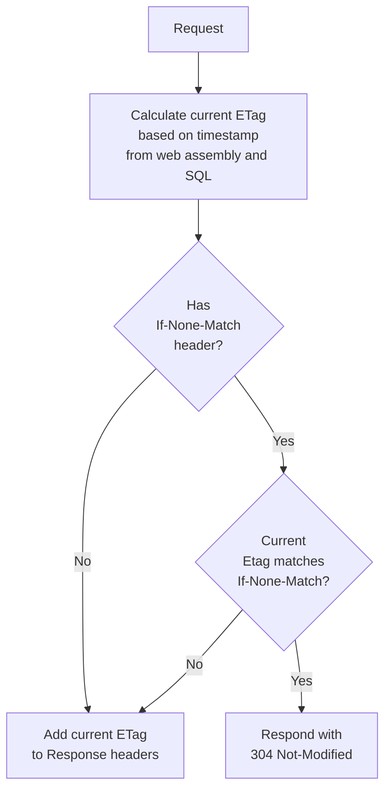

<!--
GENERATED FILE - DO NOT EDIT
This file was generated by [MarkdownSnippets](https://github.com/SimonCropp/MarkdownSnippets).
Source File: /readme.source.md
To change this file edit the source file and then run MarkdownSnippets.
-->

#  Delta

[](https://ci.appveyor.com/project/SimonCropp/Delta)
[](https://www.nuget.org/packages/Delta/)
[](https://www.nuget.org/packages/Delta.EF/)
[](https://www.nuget.org/packages/Delta.SqlServer/)

Delta is an approach to implementing a [304 Not Modified](https://www.keycdn.com/support/304-not-modified) leveraging DB change tracking.<!-- include: intro. path: /docs/mdsource/intro.include.md -->

The approach uses a last updated timestamp from the database to generate an [ETag](https://developer.mozilla.org/en-US/docs/Web/HTTP/Headers/ETag). All dynamic requests then have that ETag checked/applied.

This approach works well when the frequency of updates is relatively low. In this scenario, the majority of requests will leverage the result in a 304 Not Modified being returned and the browser loading the content its cache.

Effectively consumers will always receive the most current data, while the load on the server is reduced.<!-- endInclude -->

**See [Milestones](../../milestones?state=closed) for release notes.**


## Sponsors

### Entity Framework Extensions<!-- include: zzz. path: /docs/mdsource/zzz.include.md -->

[Entity Framework Extensions](https://entityframework-extensions.net/?utm_source=simoncropp&utm_medium=Delta) is a major sponsor and is proud to contribute to the development this project.

[](https://entityframework-extensions.net/?utm_source=simoncropp&utm_medium=Delta)<!-- endInclude -->


### JetBrains

[](https://jb.gg/OpenSourceSupport)


## Assumptions

Frequency of updates to data is relatively low compared to reads


## 304 Not Modified Flow




### SQL Server

For SQL Server the transaction log is used (via [dm_db_log_stats](https://learn.microsoft.com/en-us/sql/relational-databases/system-dynamic-management-views/sys-dm-db-log-stats-transact-sql)) if the current user has the `VIEW SERVER STATE` permission.<!-- include: sqlserver-implemenation. path: /docs/mdsource/sqlserver-implemenation.include.md -->

If `VIEW SERVER STATE` is not allowed then a combination of [Change Tracking](https://learn.microsoft.com/en-us/sql/relational-databases/track-changes/track-data-changes-sql-server) and/or [Row Versioning](https://learn.microsoft.com/en-us/sql/t-sql/data-types/rowversion-transact-sql) is used.

Give the above certain kinds of operations will be detected:

|             | Transaction Log | Change Tracking | Row Versioning | Change Tracking<br>and Row Versioning |
|-------------|:---------------:|:---------------:|:--------------:|:----------------------------------:|
| Insert      |        ✅      |        ✅       |        ✅     |                  ✅                |
| Update      |        ✅      |        ✅       |        ✅     |                  ✅                |
| Hard Delete |        ✅      |        ✅       |        ❌     |                  ✅                |
| Soft Delete |        ✅      |        ✅       |        ✅     |                  ✅                |
| Truncate    |        ✅      |        ❌       |        ❌     |                  ❌                |
<!-- endInclude -->


### Postgres

Postgres required [track_commit_timestamp](https://www.postgresql.org/docs/17/runtime-config-replication.html#GUC-TRACK-COMMIT-TIMESTAMP) to be enabled. This can be done using `ALTER SYSTEM SET track_commit_timestamp to "on"` and then restarting the Postgres service<!-- singleLineInclude: postgres-implemenation. path: /docs/mdsource/postgres-implemenation.include.md -->


## ETag calculation logic

The ETag is calculated from a combination several parts

```
{AssemblyWriteTime}-{DbTimeStamp}-{Suffix}
```


### AssemblyWriteTime

The last write time of the web entry point assembly

<!-- snippet: AssemblyWriteTime -->
<a id='snippet-AssemblyWriteTime'></a>
```cs
var webAssemblyLocation = Assembly.GetEntryAssembly()!.Location;
AssemblyWriteTime = File.GetLastWriteTime(webAssemblyLocation).Ticks.ToString();
```
<sup><a href='/src/Delta/DeltaExtensions_Shared.cs#L44-L49' title='Snippet source file'>snippet source</a> | <a href='#snippet-AssemblyWriteTime' title='Start of snippet'>anchor</a></sup>
<!-- endSnippet -->


### DB timestamp

Timestamp calculation is specific to the target database

 * [SQL Server timestamp calculation]()
 * [Postgres timestamp calculation]()


### Suffix

An optional string suffix that is dynamically calculated at runtime based on the current `HttpContext`.

<!-- snippet: Suffix -->
<a id='snippet-Suffix'></a>
```cs
var app = builder.Build();
app.UseDelta(suffix: httpContext => "MySuffix");
```
<sup><a href='/src/DeltaTests/Usage.cs#L8-L13' title='Snippet source file'>snippet source</a> | <a href='#snippet-Suffix' title='Start of snippet'>anchor</a></sup>
<!-- endSnippet -->


### Combining the above

<!-- snippet: BuildEtag -->
<a id='snippet-BuildEtag'></a>
```cs
internal static string BuildEtag(string timeStamp, string? suffix)
{
    if (suffix == null)
    {
        return $"\"{AssemblyWriteTime}-{timeStamp}\"";
    }

    return $"\"{AssemblyWriteTime}-{timeStamp}-{suffix}\"";
}
```
<sup><a href='/src/Delta/DeltaExtensions_Shared.cs#L152-L164' title='Snippet source file'>snippet source</a> | <a href='#snippet-BuildEtag' title='Start of snippet'>anchor</a></sup>
<!-- endSnippet -->


## NuGet

Delta is shipped as two nugets:

 * [Delta](https://nuget.org/packages/Delta/): Delivers functionality using SqlConnection and SqlTransaction.
 * [Delta.EF](https://nuget.org/packages/Delta.EF/): Delivers functionality using [SQL Server EF Database Provider](https://learn.microsoft.com/en-us/ef/core/providers/sql-server/?tabs=dotnet-core-cli).

Only one of the above should be used.


## UseResponseDiagnostics

Response diagnostics is an opt-out feature that includes extra log information in the response headers.

Disable by setting UseResponseDiagnostics to false at startup:

<!-- snippet: UseResponseDiagnostics -->
<a id='snippet-UseResponseDiagnostics'></a>
```cs
DeltaExtensions.UseResponseDiagnostics = false;
```
<sup><a href='/src/DeltaTests/UseResponseDiagnosticsSnippet.cs#L4-L6' title='Snippet source file'>snippet source</a> | <a href='#snippet-UseResponseDiagnostics' title='Start of snippet'>anchor</a></sup>
<!-- endSnippet -->

Response diagnostics headers are prefixed with `Delta-`.

Example Response header when the Request has not `If-None-Match` header.


## Verifying behavior

The behavior of Delta can be verified as follows:

 * Open a page in the site
 * Open the browser developer tools
 * Change to the Network tab
 * Refresh the page.

Cached responses will show as 304 in the `Status`:


In the headers `if-none-match` will show in the request and `etag` will show in the response:


### Ensure cache is not disabled

If disable cache is checked, the browser will not send the `if-none-match` header. This will effectively cause a cache miss server side, and the full server pipeline will execute.


### Certificates and Chromium

Chromium, and hence the Chrome and Edge browsers, are very sensitive to certificate problems when determining if an item should be cached. Specifically, if a request is done dynamically (type: xhr) and the server is using a self-signed certificate, then the browser will not send the `if-none-match` header. [Reference]( https://issues.chromium.org/issues/40666473). If self-signed certificates are required during development in lower environment, then use FireFox to test the caching behavior. 


## Programmatic client usage

Delta is primarily designed to support web browsers as a client. All web browsers have the necessary 304 and caching functionally required.

In the scenario where web apis (that support using 304) are being consumed using .net as a client, consider using one of the below extensions to cache responses.

 * [Replicant](https://github.com/SimonCropp/Replicant)
 * [Tavis.HttpCache](https://github.com/tavis-software/Tavis.HttpCache)
 * [CacheCow](https://github.com/aliostad/CacheCow)
 * [Monkey Cache](https://github.com/jamesmontemagno/monkey-cache)


## Icon

[Estuary](https://thenounproject.com/term/estuary/1847616/) designed by [Daan](https://thenounproject.com/Asphaleia/) from [The Noun Project](https://thenounproject.com).
