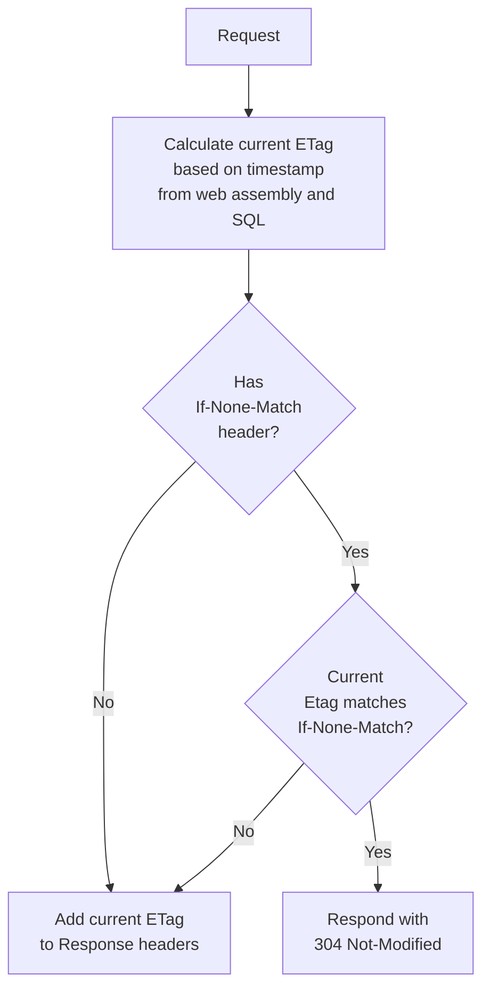

#  Delta

[](https://ci.appveyor.com/project/SimonCropp/Delta)
[](https://www.nuget.org/packages/Delta/)

Delta is an opinionated approach to implement a [304 Not Modified](https://www.keycdn.com/support/304-not-modified)


## Assumptions

Assume the following combination of technologies are being used:

 * [ASP.net Core](https://learn.microsoft.com/en-us/aspnet/core/)
 * [Entity Framework Core](https://learn.microsoft.com/en-us/ef/)
 * [Microsoft SQL Server EF Core Database Provider](https://learn.microsoft.com/en-us/ef/core/providers/sql-server/)
 * Either [SQL Server Change Tracking](https://learn.microsoft.com/en-us/sql/relational-databases/track-changes/track-data-changes-sql-server) and/or [SQL Server Row Versioning](https://learn.microsoft.com/en-us/sql/t-sql/data-types/rowversion-transact-sql)


## 304 Not Modified Flow





## ETag value


### AssemblyWriteTime

The last write time of the web entry point assembly

<!-- snippet: AssemblyWriteTime -->
<a id='snippet-assemblywritetime'></a>
```cs
internal static string AssemblyWriteTime = File.GetLastWriteTime(Assembly.GetEntryAssembly()!.Location).Ticks.ToString();
```
<sup><a href='/src/Delta/DeltaExtensions_MiddleWare.cs#L5-L9' title='Snippet source file'>snippet source</a> | <a href='#snippet-assemblywritetime' title='Start of snippet'>anchor</a></sup>
<!-- endSnippet -->


### SQL timestamp

<!-- snippet: SqlTimestamp -->
<a id='snippet-sqltimestamp'></a>
```cs
declare @changeTracking bigint = change_tracking_current_version();
declare @timeStamp bigint = convert(bigint, @@dbts);

if (@changeTracking is null)
    select cast(@timeStamp as varchar)
else
    select cast(@timeStamp as varchar) + '-' + cast(@changeTracking as varchar)
```
<sup><a href='/src/Delta/DeltaExtensions.cs#L157-L165' title='Snippet source file'>snippet source</a> | <a href='#snippet-sqltimestamp' title='Start of snippet'>anchor</a></sup>
<!-- endSnippet -->


### Suffix

An option string suffix that is dynamically caculated at runtime based on the current `HttpContext`.

<!-- snippet: Suffix -->
<a id='snippet-suffix'></a>
```cs
var app = builder.Build();
app.UseDelta<SampleDbContext>(
    suffix: httpContext => "MySuffix");
```
<sup><a href='/src/Tests/Usage.cs#L8-L14' title='Snippet source file'>snippet source</a> | <a href='#snippet-suffix' title='Start of snippet'>anchor</a></sup>
<!-- endSnippet -->


### Combining the above

<!-- snippet: BuildEtag -->
<a id='snippet-buildetag'></a>
```cs
internal static string BuildEtag(string timeStamp, string? suffix)
{
    if (suffix == null)
    {
        return $"\"{AssemblyWriteTime}-{timeStamp}\"";
    }

    return $"\"{AssemblyWriteTime}-{timeStamp}-{suffix}\"";
}
```
<sup><a href='/src/Delta/DeltaExtensions_MiddleWare.cs#L135-L147' title='Snippet source file'>snippet source</a> | <a href='#snippet-buildetag' title='Start of snippet'>anchor</a></sup>
<!-- endSnippet -->


## NuGet

https://nuget.org/packages/Delta/


## Usage


### DbContext using RowVersion

<!-- snippet: SampleDbContext.cs -->
<a id='snippet-SampleDbContext.cs'></a>
```cs
public class SampleDbContext :
    DbContext
{
    public DbSet<Employee> Employees { get; set; } = null!;
    public DbSet<Company> Companies { get; set; } = null!;

    public SampleDbContext(DbContextOptions options) :
        base(options)
    {
    }

    protected override void OnModelCreating(ModelBuilder modelBuilder)
    {
        var company = modelBuilder.Entity<Company>();
        company
            .HasMany(c => c.Employees)
            .WithOne(e => e.Company)
            .IsRequired();
        company
            .Property(_ => _.RowVersion)
            .IsRowVersion()
            .HasConversion<byte[]>();

        var employee = modelBuilder.Entity<Employee>();
        employee
            .Property(_ => _.RowVersion)
            .IsRowVersion()
            .HasConversion<byte[]>();
    }
}
```
<sup><a href='/src/WebApplication/DataContext/SampleDbContext.cs#L1-L30' title='Snippet source file'>snippet source</a> | <a href='#snippet-SampleDbContext.cs' title='Start of snippet'>anchor</a></sup>
<!-- endSnippet -->


### Add to Builder

<!-- snippet: UseDelta -->
<a id='snippet-usedelta'></a>
```cs
var builder = WebApplication.CreateBuilder(args);
builder.Services.AddSqlServer<SampleDbContext>(database.ConnectionString);
var app = builder.Build();
app.UseDelta<SampleDbContext>();
```
<sup><a href='/src/WebApplication/Program.cs#L6-L13' title='Snippet source file'>snippet source</a> | <a href='#snippet-usedelta' title='Start of snippet'>anchor</a></sup>
<!-- endSnippet -->


### Add to a group

<!-- snippet: UseDeltaMapGroup -->
<a id='snippet-usedeltamapgroup'></a>
```cs
app.MapGroup("/group")
    .UseDelta<SampleDbContext>()
    .MapGet("/", () => "Hello Group!");
```
<sup><a href='/src/WebApplication/Program.cs#L17-L23' title='Snippet source file'>snippet source</a> | <a href='#snippet-usedeltamapgroup' title='Start of snippet'>anchor</a></sup>
<!-- endSnippet -->


## Icon

[Estuary](https://thenounproject.com/term/estuary/1847616/) designed by [Daan](https://thenounproject.com/Asphaleia/) from [The Noun Project](https://thenounproject.com).
