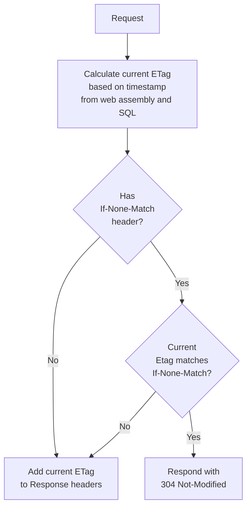

#  Delta

[](https://ci.appveyor.com/project/SimonCropp/Delta)
[](https://www.nuget.org/packages/Delta/)

Delta is an opinionated approach to implementing a [304 Not Modified](https://www.keycdn.com/support/304-not-modified)

The approach uses a last updated timestamp from the database to generate an [ETag](https://developer.mozilla.org/en-US/docs/Web/HTTP/Headers/ETag). All dynamic requests then have that ETag checked/applied.

This approach works well when the frequency of updates is realtively low. In this scenario, the majory of requests will leverage the result in a 304 Not Modified being returned and the browser loading the content its cache.

Effectively consumers will always receive the most current data, while the load on the server remains very low.


## Assumptions

Assume the following combination of technologies are being used:

 * Frequency of updates to data is realtively low
 * [ASP.net Core](https://learn.microsoft.com/en-us/aspnet/core/)
 * [Entity Framework Core](https://learn.microsoft.com/en-us/ef/)
 * [Microsoft SQL Server EF Core Database Provider](https://learn.microsoft.com/en-us/ef/core/providers/sql-server/)
 * Either [SQL Server Change Tracking](https://learn.microsoft.com/en-us/sql/relational-databases/track-changes/track-data-changes-sql-server) and/or [SQL Server Row Versioning](https://learn.microsoft.com/en-us/sql/t-sql/data-types/rowversion-transact-sql)


## 304 Not Modified Flow




## ETag calculation logic

The ETag is calcualted from a combination several parts


#### AssemblyWriteTime

The last write time of the web entry point assembly

<!-- snippet: AssemblyWriteTime -->
<a id='snippet-assemblywritetime'></a>
```cs
var webAssemblyLocation = Assembly.GetEntryAssembly()!.Location;
AssemblyWriteTime = File.GetLastWriteTime(webAssemblyLocation).Ticks.ToString();
```
<sup><a href='/src/Delta/DeltaExtensions_MiddleWare.cs#L10-L15' title='Snippet source file'>snippet source</a> | <a href='#snippet-assemblywritetime' title='Start of snippet'>anchor</a></sup>
<!-- endSnippet -->


#### SQL timestamp

A combination of [change_tracking_current_version](https://learn.microsoft.com/en-us/sql/relational-databases/system-functions/change-tracking-current-version-transact-sql) (if tracking is enabled) and [@@DBTS (row version timestamp)](https://learn.microsoft.com/en-us/sql/t-sql/functions/dbts-transact-sql)


<!-- snippet: SqlTimestamp -->
<a id='snippet-sqltimestamp'></a>
```cs
declare @changeTracking bigint = change_tracking_current_version();
declare @timeStamp bigint = convert(bigint, @@dbts);

if (@changeTracking is null)
    select cast(@timeStamp as varchar)
else
    select cast(@timeStamp as varchar) + '-' + cast(@changeTracking as varchar)
```
<sup><a href='/src/Delta/DeltaExtensions.cs#L206-L214' title='Snippet source file'>snippet source</a> | <a href='#snippet-sqltimestamp' title='Start of snippet'>anchor</a></sup>
<!-- endSnippet -->


#### Suffix

An optional string suffix that is dynamically caculated at runtime based on the current `HttpContext`.

<!-- snippet: Suffix -->
<a id='snippet-suffix'></a>
```cs
var app = builder.Build();
app.UseDelta<SampleDbContext>(
    suffix: httpContext => "MySuffix");
```
<sup><a href='/src/Tests/Usage.cs#L8-L14' title='Snippet source file'>snippet source</a> | <a href='#snippet-suffix' title='Start of snippet'>anchor</a></sup>
<!-- endSnippet -->


### Combining the above

<!-- snippet: BuildEtag -->
<a id='snippet-buildetag'></a>
```cs
internal static string BuildEtag(string timeStamp, string? suffix)
{
    if (suffix == null)
    {
        return $"\"{AssemblyWriteTime}-{timeStamp}\"";
    }

    return $"\"{AssemblyWriteTime}-{timeStamp}-{suffix}\"";
}
```
<sup><a href='/src/Delta/DeltaExtensions_MiddleWare.cs#L149-L161' title='Snippet source file'>snippet source</a> | <a href='#snippet-buildetag' title='Start of snippet'>anchor</a></sup>
<!-- endSnippet -->


## NuGet

https://nuget.org/packages/Delta/


## Usage


### DbContext using RowVersion

<!-- snippet: SampleDbContext.cs -->
<a id='snippet-SampleDbContext.cs'></a>
```cs
public class SampleDbContext :
    DbContext
{
    public DbSet<Employee> Employees { get; set; } = null!;
    public DbSet<Company> Companies { get; set; } = null!;

    public SampleDbContext(DbContextOptions options) :
        base(options)
    {
    }

    protected override void OnModelCreating(ModelBuilder modelBuilder)
    {
        var company = modelBuilder.Entity<Company>();
        company
            .HasMany(c => c.Employees)
            .WithOne(e => e.Company)
            .IsRequired();
        company
            .Property(_ => _.RowVersion)
            .IsRowVersion()
            .HasConversion<byte[]>();

        var employee = modelBuilder.Entity<Employee>();
        employee
            .Property(_ => _.RowVersion)
            .IsRowVersion()
            .HasConversion<byte[]>();
    }
}
```
<sup><a href='/src/WebApplication/DataContext/SampleDbContext.cs#L1-L30' title='Snippet source file'>snippet source</a> | <a href='#snippet-SampleDbContext.cs' title='Start of snippet'>anchor</a></sup>
<!-- endSnippet -->


### Add to Builder

<!-- snippet: UseDelta -->
<a id='snippet-usedelta'></a>
```cs
var builder = WebApplication.CreateBuilder(args);
builder.Services.AddSqlServer<SampleDbContext>(database.ConnectionString);
var app = builder.Build();
app.UseDelta<SampleDbContext>();
```
<sup><a href='/src/WebApplication/Program.cs#L6-L13' title='Snippet source file'>snippet source</a> | <a href='#snippet-usedelta' title='Start of snippet'>anchor</a></sup>
<!-- endSnippet -->


### Add to a group

<!-- snippet: UseDeltaMapGroup -->
<a id='snippet-usedeltamapgroup'></a>
```cs
app.MapGroup("/group")
    .UseDelta<SampleDbContext>()
    .MapGet("/", () => "Hello Group!");
```
<sup><a href='/src/WebApplication/Program.cs#L17-L23' title='Snippet source file'>snippet source</a> | <a href='#snippet-usedeltamapgroup' title='Start of snippet'>anchor</a></sup>
<!-- endSnippet -->


### ShouldExecute

Optional control what requests Delta is executed on.

<!-- snippet: ShouldExecute -->
<a id='snippet-shouldexecute'></a>
```cs
var app = builder.Build();
app.UseDelta<SampleDbContext>(
    shouldExecute: httpContext =>
    {
        var path = httpContext.Request.Path.ToString();
        return path.Contains("match");
    });
```
<sup><a href='/src/Tests/Usage.cs#L19-L29' title='Snippet source file'>snippet source</a> | <a href='#snippet-shouldexecute' title='Start of snippet'>anchor</a></sup>
<!-- endSnippet -->


## EF/SQL helpers


### GetLastTimeStamp


#### For a `DbContext`:

<!-- snippet: GetLastTimeStampDbContext -->
<a id='snippet-getlasttimestampdbcontext'></a>
```cs
var timeStamp = await dbContext.GetLastTimeStamp();
```
<sup><a href='/src/Tests/Usage.cs#L58-L62' title='Snippet source file'>snippet source</a> | <a href='#snippet-getlasttimestampdbcontext' title='Start of snippet'>anchor</a></sup>
<!-- endSnippet -->


#### For a `DbConnection`:

<!-- snippet: GetLastTimeStampDbConnection -->
<a id='snippet-getlasttimestampdbconnection'></a>
```cs
var timeStamp = await sqlConnection.GetLastTimeStamp();
```
<sup><a href='/src/Tests/Usage.cs#L74-L78' title='Snippet source file'>snippet source</a> | <a href='#snippet-getlasttimestampdbconnection' title='Start of snippet'>anchor</a></sup>
<!-- endSnippet -->


### GetDatabasesWithTracking

Get a list of all databases with change tracking enabled.

<!-- snippet: GetDatabasesWithTracking -->
<a id='snippet-getdatabaseswithtracking'></a>
```cs
var trackedDatabases = await sqlConnection.GetTrackedDatabases();
foreach (var db in trackedDatabases)
{
    Trace.WriteLine(db);
}
```
<sup><a href='/src/Tests/Usage.cs#L110-L118' title='Snippet source file'>snippet source</a> | <a href='#snippet-getdatabaseswithtracking' title='Start of snippet'>anchor</a></sup>
<!-- endSnippet -->

Uses the following SQL:

<!-- snippet: GetTrackedDatabasesSql -->
<a id='snippet-gettrackeddatabasessql'></a>
```cs
select d.name
from sys.databases as d inner join
    sys.change_tracking_databases as t on
    t.database_id = d.database_id
```
<sup><a href='/src/Delta/DeltaExtensions.cs#L154-L159' title='Snippet source file'>snippet source</a> | <a href='#snippet-gettrackeddatabasessql' title='Start of snippet'>anchor</a></sup>
<!-- endSnippet -->


### GetTrackedTables

Get a list of all tracked tables in database.

<!-- snippet: GetTrackedTables -->
<a id='snippet-gettrackedtables'></a>
```cs
var trackedTables = await sqlConnection.GetTrackedTables();
foreach (var db in trackedTables)
{
    Trace.WriteLine(db);
}
```
<sup><a href='/src/Tests/Usage.cs#L140-L148' title='Snippet source file'>snippet source</a> | <a href='#snippet-gettrackedtables' title='Start of snippet'>anchor</a></sup>
<!-- endSnippet -->

Uses the following SQL:

<!-- snippet: GetTrackedTablesSql -->
<a id='snippet-gettrackedtablessql'></a>
```cs
select t.Name
from sys.tables as t left join
    sys.change_tracking_tables as c on t.[object_id] = c.[object_id]
where c.[object_id] is not null
```
<sup><a href='/src/Delta/DeltaExtensions.cs#L94-L99' title='Snippet source file'>snippet source</a> | <a href='#snippet-gettrackedtablessql' title='Start of snippet'>anchor</a></sup>
<!-- endSnippet -->


### IsTrackingEnabled

Determine if change tracking is enabled for a database.

<!-- snippet: IsTrackingEnabled -->
<a id='snippet-istrackingenabled'></a>
```cs
var isTrackingEnabled = await sqlConnection.IsTrackingEnabled();
```
<sup><a href='/src/Tests/Usage.cs#L209-L213' title='Snippet source file'>snippet source</a> | <a href='#snippet-istrackingenabled' title='Start of snippet'>anchor</a></sup>
<!-- endSnippet -->

Uses the following SQL:

<!-- snippet: IsTrackingEnabledSql -->
<a id='snippet-istrackingenabledsql'></a>
```cs
select count(d.name)
from sys.databases as d inner join
    sys.change_tracking_databases as t on
    t.database_id = d.database_id
where d.name = '{connection.Database}'
```
<sup><a href='/src/Delta/DeltaExtensions.cs#L114-L120' title='Snippet source file'>snippet source</a> | <a href='#snippet-istrackingenabledsql' title='Start of snippet'>anchor</a></sup>
<!-- endSnippet -->


### EnableTracking

Enable change tracking for a database.

<!-- snippet: EnableTracking -->
<a id='snippet-enabletracking'></a>
```cs
await sqlConnection.EnableTracking();
```
<sup><a href='/src/Tests/Usage.cs#L203-L207' title='Snippet source file'>snippet source</a> | <a href='#snippet-enabletracking' title='Start of snippet'>anchor</a></sup>
<!-- endSnippet -->

Uses the following SQL:

<!-- snippet: EnableTrackingSql -->
<a id='snippet-enabletrackingsql'></a>
```cs
alter database {connection.Database}
set change_tracking = on
(
    change_retention = {retentionDays} days,
    auto_cleanup = on
)
```
<sup><a href='/src/Delta/DeltaExtensions.cs#L79-L86' title='Snippet source file'>snippet source</a> | <a href='#snippet-enabletrackingsql' title='Start of snippet'>anchor</a></sup>
<!-- endSnippet -->


### DisableTracking

Disable change tracking for a database and all tables within that database.

<!-- snippet: DisableTracking -->
<a id='snippet-disabletracking'></a>
```cs
await sqlConnection.DisableTracking();
```
<sup><a href='/src/Tests/Usage.cs#L188-L192' title='Snippet source file'>snippet source</a> | <a href='#snippet-disabletracking' title='Start of snippet'>anchor</a></sup>
<!-- endSnippet -->

Uses the following SQL:

<!-- snippet: DisableTrackingSql -->
<a id='snippet-disabletrackingsql'></a>
```cs
alter table [{table}] disable change_tracking;
```
<sup><a href='/src/Delta/DeltaExtensions.cs#L135-L137' title='Snippet source file'>snippet source</a> | <a href='#snippet-disabletrackingsql' title='Start of snippet'>anchor</a></sup>
<a id='snippet-disabletrackingsql-1'></a>
```cs
alter database [{connection.Database}] set change_tracking = off;
```
<sup><a href='/src/Delta/DeltaExtensions.cs#L142-L144' title='Snippet source file'>snippet source</a> | <a href='#snippet-disabletrackingsql-1' title='Start of snippet'>anchor</a></sup>
<!-- endSnippet -->


### SetTrackedTables

Enables change tracking for all tables listed, and disables change tracking for all tables not listed.

<!-- snippet: SetTrackedTables -->
<a id='snippet-settrackedtables'></a>
```cs
await sqlConnection.SetTrackedTables(
    new[]
    {
        "Companies"
    });
```
<sup><a href='/src/Tests/Usage.cs#L130-L138' title='Snippet source file'>snippet source</a> | <a href='#snippet-settrackedtables' title='Start of snippet'>anchor</a></sup>
<!-- endSnippet -->

Uses the following SQL:

<!-- snippet: EnableTrackingSql -->
<a id='snippet-enabletrackingsql'></a>
```cs
alter database {connection.Database}
set change_tracking = on
(
    change_retention = {retentionDays} days,
    auto_cleanup = on
)
```
<sup><a href='/src/Delta/DeltaExtensions.cs#L79-L86' title='Snippet source file'>snippet source</a> | <a href='#snippet-enabletrackingsql' title='Start of snippet'>anchor</a></sup>
<!-- endSnippet -->

<!-- snippet: EnableTrackingTableSql -->
<a id='snippet-enabletrackingtablesql'></a>
```cs
alter table [{table}] enable change_tracking
```
<sup><a href='/src/Delta/DeltaExtensions.cs#L46-L48' title='Snippet source file'>snippet source</a> | <a href='#snippet-enabletrackingtablesql' title='Start of snippet'>anchor</a></sup>
<!-- endSnippet -->

<!-- snippet: DisableTrackingTableSql -->
<a id='snippet-disabletrackingtablesql'></a>
```cs
alter table [{table}] disable change_tracking;
```
<sup><a href='/src/Delta/DeltaExtensions.cs#L55-L57' title='Snippet source file'>snippet source</a> | <a href='#snippet-disabletrackingtablesql' title='Start of snippet'>anchor</a></sup>
<!-- endSnippet -->


## Icon

[Estuary](https://thenounproject.com/term/estuary/1847616/) designed by [Daan](https://thenounproject.com/Asphaleia/) from [The Noun Project](https://thenounproject.com).
