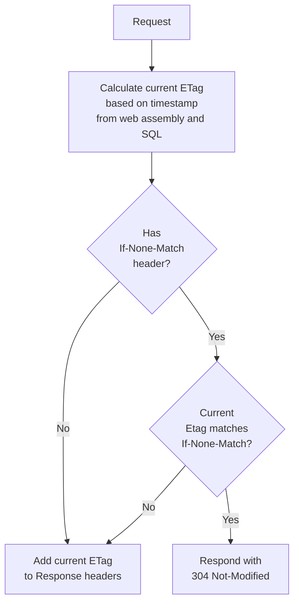

#  Delta

Delta is an approach to implementing a [304 Not Modified](https://www.keycdn.com/support/304-not-modified) leveraging SqlServer change tracking

The approach uses a last updated timestamp from the database to generate an [ETag](https://developer.mozilla.org/en-US/docs/Web/HTTP/Headers/ETag). All dynamic requests then have that ETag checked/applied.

This approach works well when the frequency of updates is relatively low. In this scenario, the majority of requests will leverage the result in a 304 Not Modified being returned and the browser loading the content its cache.

Effectively consumers will always receive the most current data, while the load on the server remains low.

**See [Milestones](../../milestones?state=closed) for release notes.**

## Assumptions

 * Frequency of updates to data is relatively low compared to reads
 * Using either [SQL Server Change Tracking](https://learn.microsoft.com/en-us/sql/relational-databases/track-changes/track-data-changes-sql-server) and/or [SQL Server Row Versioning](https://learn.microsoft.com/en-us/sql/t-sql/data-types/rowversion-transact-sql)

## 304 Not Modified Flow

## ETag calculation logic

The ETag is calculated from a combination several parts

#### AssemblyWriteTime

The last write time of the web entry point assembly

snippet: AssemblyWriteTime

#### SQL timestamp

A combination of [change_tracking_current_version](https://learn.microsoft.com/en-us/sql/relational-databases/system-functions/change-tracking-current-version-transact-sql) (if tracking is enabled) and [@@DBTS (row version timestamp)](https://learn.microsoft.com/en-us/sql/t-sql/functions/dbts-transact-sql)

snippet: SqlServerTimestamp

#### Suffix

An optional string suffix that is dynamically calculated at runtime based on the current `HttpContext`.

snippet: Suffix

### Combining the above

snippet: BuildEtag

## NuGet

Delta is shipped as two nugets:

 * [Delta](https://nuget.org/packages/Delta/): Delivers functionality using SqlConnection and SqlTransaction.
 * [Delta.EF](https://nuget.org/packages/Delta.EF/): Delivers functionality using [SQL Server EF Database Provider](https://learn.microsoft.com/en-us/ef/core/providers/sql-server/?tabs=dotnet-core-cli).

Only one of the above should be used.

## Usage

### DB Schema

Ensure [SQL Server Change Tracking](https://learn.microsoft.com/en-us/sql/relational-databases/track-changes/track-data-changes-sql-server) and/or [SQL Server Row Versioning](https://learn.microsoft.com/en-us/sql/t-sql/data-types/rowversion-transact-sql) is enabled for all relevant tables.

Example SQL schema:

snippet: Usage.Schema.verified.sql

### Add to WebApplicationBuilder

snippet: UseDelta

### Add to a Route Group

To add to a specific [Route Group](https://learn.microsoft.com/en-us/aspnet/core/fundamentals/minimal-apis/route-handlers#route-groups):

snippet: UseDeltaMapGroup

### ShouldExecute

Optionally control what requests Delta is executed on.

snippet: ShouldExecute

### Custom Connection discovery

By default, Delta uses `HttpContext.RequestServices` to discover the SqlConnection and SqlTransaction:

snippet: DiscoverConnection

To use custom connection discovery:

snippet: CustomDiscoveryConnection

To use custom connection and transaction discovery:

snippet: CustomDiscoveryConnectionAndTransaction

## EF Usage

### DbContext using RowVersion

Enable row versioning in Entity Framework

snippet: SampleDbContext.cs

### Add to WebApplicationBuilder

snippet: UseDeltaEF

### Add to a Route Group

To add to a specific [Route Group](https://learn.microsoft.com/en-us/aspnet/core/fundamentals/minimal-apis/route-handlers#route-groups):

snippet: UseDeltaMapGroupEF

### ShouldExecute

Optionally control what requests Delta is executed on.

snippet: ShouldExecuteEF

## UseResponseDiagnostics

Response diagnostics is an opt-in feature that includes extra log information in the response headers.

Enable by setting UseResponseDiagnostics to true at startup:

snippet: UseResponseDiagnostics

Response diagnostics headers are prefixed with `Delta-`.

Example Response header when the Request has not `If-None-Match` header.

## Helpers

Utility methods for working with databases using the Delta conventions.

### GetLastTimeStamp

#### For a `SqlConnection`:

snippet: GetLastTimeStampSqlConnection

#### For a `DbContext`:

snippet: GetLastTimeStampEF

### GetDatabasesWithTracking

Get a list of all databases with change tracking enabled.

snippet: GetDatabasesWithTracking

Uses the following SQL:

snippet: GetTrackedDatabasesSql

### GetTrackedTables

Get a list of all tracked tables in database.

snippet: GetTrackedTables

Uses the following SQL:

snippet: GetTrackedTablesSql

### IsTrackingEnabled

Determine if change tracking is enabled for a database.

snippet: IsTrackingEnabled

Uses the following SQL:

snippet: IsTrackingEnabledSql

### EnableTracking

Enable change tracking for a database.

snippet: EnableTracking

Uses the following SQL:

snippet: EnableTrackingSql

### DisableTracking

Disable change tracking for a database and all tables within that database.

snippet: DisableTracking

Uses the following SQL:

#### For disabling tracking on a database:

snippet: DisableTrackingSqlDB

#### For disabling tracking on tables:

snippet: DisableTrackingSqlTable

### SetTrackedTables

Enables change tracking for all tables listed, and disables change tracking for all tables not listed.

snippet: SetTrackedTables

Uses the following SQL:

#### For enabling tracking on a database:

snippet: EnableTrackingSql

#### For enabling tracking on tables:

snippet: EnableTrackingTableSql

#### For disabling tracking on tables:

snippet: DisableTrackingTableSql

## Programmatic client usage

Delta is primarily designed to support web browsers as a client. All web browsers have the necessary 304 and caching functionally required.

In the scenario where web apis (that support using 304) are being consumed using .net as a client, consider using one of the below extensions to cache responses.

 * [Replicant](https://github.com/SimonCropp/Replicant)
 * [Tavis.HttpCache](https://github.com/tavis-software/Tavis.HttpCache)
 * [CacheCow](https://github.com/aliostad/CacheCow)
 * [Monkey Cache](https://github.com/jamesmontemagno/monkey-cache)

## Icon

[Estuary](https://thenounproject.com/term/estuary/1847616/) designed by [Daan](https://thenounproject.com/Asphaleia/) from [The Noun Project](https://thenounproject.com).

postgres

ALTER SYSTEM SET track_commit_timestamp to "on";

https://www.postgresql.org/docs/17/runtime-config-replication.html#GUC-TRACK-COMMIT-TIMESTAMP