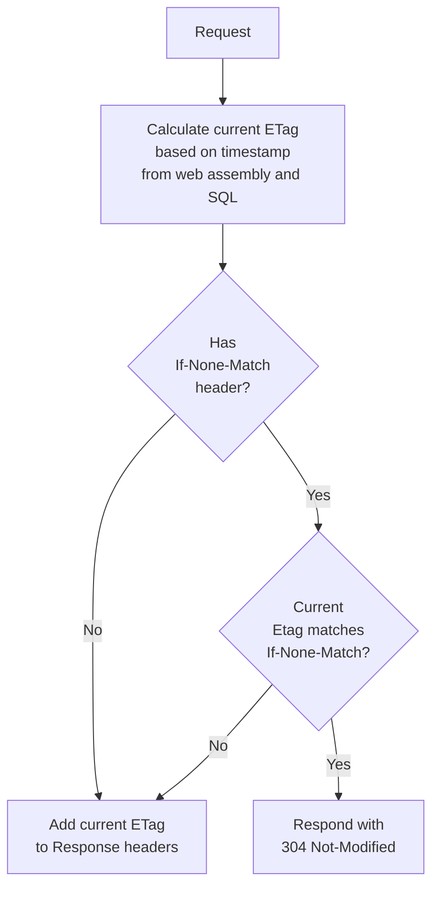

#  Delta

[](https://ci.appveyor.com/project/SimonCropp/Delta)
[](https://www.nuget.org/packages/Delta/)
[](https://www.nuget.org/packages/Delta.EF/)
[](https://www.nuget.org/packages/Delta.SqlServer/)

include: intro

**See [Milestones](../../milestones?state=closed) for release notes.**


## Sponsors

include: zzz


### JetBrains

[](https://jb.gg/OpenSourceSupport)


## Assumptions

Frequency of updates to data is relatively low compared to reads


## 304 Not Modified Flow




### SQL Server

include: sqlserver-implemenation


### Postgres

include: postgres-implemenation


## ETag calculation logic

The ETag is calculated from a combination several parts


### AssemblyWriteTime

The last write time of the web entry point assembly

snippet: AssemblyWriteTime


### SQL timestamp


#### SQL Server


##### `VIEW SERVER STATE` permission

Transaction log is used via [dm_db_log_stats](https://learn.microsoft.com/en-us/sql/relational-databases/system-dynamic-management-views/sys-dm-db-log-stats-transact-sql).

```sql
select log_end_lsn
from sys.dm_db_log_stats(db_id())
```


##### No `VIEW SERVER STATE` permission

A combination of [change_tracking_current_version](https://learn.microsoft.com/en-us/sql/relational-databases/system-functions/change-tracking-current-version-transact-sql) (if tracking is enabled) and [@@DBTS (row version timestamp)](https://learn.microsoft.com/en-us/sql/t-sql/functions/dbts-transact-sql)

```sql
declare @changeTracking bigint = change_tracking_current_version();
declare @timeStamp bigint = convert(bigint, @@dbts);

if (@changeTracking is null)
  select cast(@timeStamp as varchar)
else
  select cast(@timeStamp as varchar) + '-' + cast(@changeTracking as varchar)
```


#### Postgres

```sql
select pg_last_committed_xact();
```


### Suffix

An optional string suffix that is dynamically calculated at runtime based on the current `HttpContext`.

snippet: Suffix


### Combining the above

snippet: BuildEtag


## NuGet

Delta is shipped as two nugets:

 * [Delta](https://nuget.org/packages/Delta/): Delivers functionality using SqlConnection and SqlTransaction.
 * [Delta.EF](https://nuget.org/packages/Delta.EF/): Delivers functionality using [SQL Server EF Database Provider](https://learn.microsoft.com/en-us/ef/core/providers/sql-server/?tabs=dotnet-core-cli).

Only one of the above should be used.


## Usage


### SQL Server DB Schema

Example SQL schema:

snippet: Usage.Schema.verified.sql


### Postgres DB Schema

Example SQL schema:

snippet: PostgresSchema


### Add to WebApplicationBuilder


#### SQL Server

snippet: UseDeltaSqlServer


#### PostgreSQL

snippet: UseDeltaPostgres


### Add to a Route Group

To add to a specific [Route Group](https://learn.microsoft.com/en-us/aspnet/core/fundamentals/minimal-apis/route-handlers#route-groups):

snippet: UseDeltaMapGroup


### ShouldExecute

Optionally control what requests Delta is executed on.

snippet: ShouldExecute


### Custom Connection discovery

By default, Delta uses `HttpContext.RequestServices` to discover the SqlConnection and SqlTransaction:

snippet: DiscoverConnection

To use custom connection discovery:

snippet: CustomDiscoveryConnection

To use custom connection and transaction discovery:

snippet: CustomDiscoveryConnectionAndTransaction


### GetLastTimeStamp

For a `DbConnection`:

snippet: GetLastTimeStampConnection


## EF Usage


### SqlServer DbContext using RowVersion

Enable row versioning in Entity Framework

snippet: SampleSqlServerDbContext


### Postgres DbContext

Enable row versioning in Entity Framework

snippet: SamplePostgresDbContext


### Add to WebApplicationBuilder


#### SQL Server

snippet: UseDeltaSQLServerEF


#### Postgres

snippet: UseDeltaPostgresEF


### Add to a Route Group

To add to a specific [Route Group](https://learn.microsoft.com/en-us/aspnet/core/fundamentals/minimal-apis/route-handlers#route-groups):

snippet: UseDeltaMapGroupEF


### ShouldExecute

Optionally control what requests Delta is executed on.

snippet: ShouldExecuteEF


### GetLastTimeStamp:

snippet: GetLastTimeStampEF


## UseResponseDiagnostics

Response diagnostics is an opt-out feature that includes extra log information in the response headers.

Disable by setting UseResponseDiagnostics to false at startup:

snippet: UseResponseDiagnostics

Response diagnostics headers are prefixed with `Delta-`.

Example Response header when the Request has not `If-None-Match` header.


## Delta.SqlServer

A set of helper methods for working with [SQL Server Change Tracking](https://learn.microsoft.com/en-us/sql/relational-databases/track-changes/track-data-changes-sql-server) and [SQL Server Row Versioning](https://learn.microsoft.com/en-us/sql/t-sql/data-types/rowversion-transact-sql)

Nuget: [Delta.SqlServer](https://www.nuget.org/packages/Delta.SqlServer)


### GetDatabasesWithTracking

Get a list of all databases with change tracking enabled.

snippet: GetDatabasesWithTracking

Uses the following SQL:

snippet: GetTrackedDatabasesSql


### GetTrackedTables

Get a list of all tracked tables in database.

snippet: GetTrackedTables

Uses the following SQL:

snippet: GetTrackedTablesSql


### IsTrackingEnabled

Determine if change tracking is enabled for a database.

snippet: IsTrackingEnabled

Uses the following SQL:

snippet: IsTrackingEnabledSql


### EnableTracking

Enable change tracking for a database.

snippet: EnableTracking

Uses the following SQL:

snippet: EnableTrackingSql


### DisableTracking

Disable change tracking for a database and all tables within that database.

snippet: DisableTracking

Uses the following SQL:


#### For disabling tracking on a database:

snippet: DisableTrackingSqlDB


#### For disabling tracking on tables:

snippet: DisableTrackingSqlTable


### SetTrackedTables

Enables change tracking for all tables listed, and disables change tracking for all tables not listed.

snippet: SetTrackedTables

Uses the following SQL:


#### For enabling tracking on a database:

snippet: EnableTrackingSql


#### For enabling tracking on tables:

snippet: EnableTrackingTableSql


#### For disabling tracking on tables:

snippet: DisableTrackingTableSql


## Verifying behavior

The behavior of Delta can be verified as follows:

 * Open a page in the site
 * Open the browser developer tools
 * Change to the Network tab
 * Refresh the page.

Cached responses will show as 304 in the `Status`:


In the headers `if-none-match` will show in the request and `etag` will show in the response:


### Ensure cache is not disabled

If disable cache is checked, the browser will not send the `if-none-match` header. This will effectively cause a cache miss server side, and the full server pipeline will execute.


### Certificates and Chromium

Chromium, and hence the Chrome and Edge browsers, are very sensitive to certificate problems when determining if an item should be cached. Specifically, if a request is done dynamically (type: xhr) and the server is using a self-signed certificate, then the browser will not send the `if-none-match` header. [Reference]( https://issues.chromium.org/issues/40666473). If self-signed certificates are required during development in lower environment, then use FireFox to test the caching behavior. 


## Programmatic client usage

Delta is primarily designed to support web browsers as a client. All web browsers have the necessary 304 and caching functionally required.

In the scenario where web apis (that support using 304) are being consumed using .net as a client, consider using one of the below extensions to cache responses.

 * [Replicant](https://github.com/SimonCropp/Replicant)
 * [Tavis.HttpCache](https://github.com/tavis-software/Tavis.HttpCache)
 * [CacheCow](https://github.com/aliostad/CacheCow)
 * [Monkey Cache](https://github.com/jamesmontemagno/monkey-cache)


## Icon

[Estuary](https://thenounproject.com/term/estuary/1847616/) designed by [Daan](https://thenounproject.com/Asphaleia/) from [The Noun Project](https://thenounproject.com).

